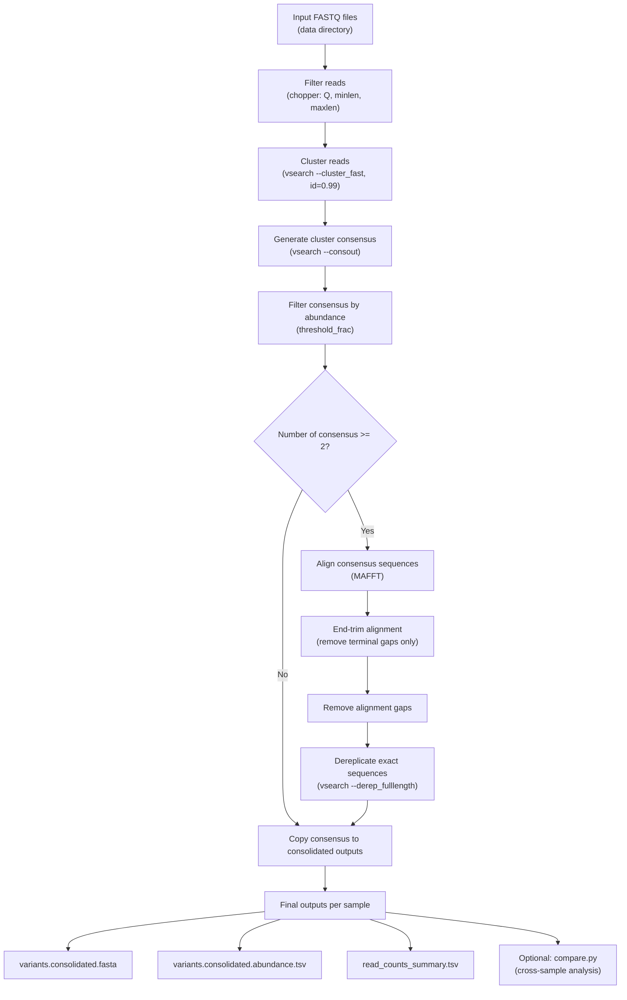

# NovoClust Workflow Overview

This Snakemake workflow performs de novo sequence variant discovery and abundance estimation from long-read FASTQ data (e.g., ONT amplicon sequencing).

**The pipeline:**
 1. Filters reads by quality and length
 2. Clusters reads at high identity (default 99%)
 3. Generates cluster consensus sequences
 4. Filters consensus sequences by abundance threshold
 5. Aligns consensus sequences (if >1 variant)
 6. End-trims alignment (removes only terminal gaps)
 7. Removes internal alignment gaps
 8. Dereplicates identical sequences
 9. Recalculates variant abundances

Outputs final variant FASTA and abundance tables.
The workflow is fully reproducible using Snakemake with conda environments.

**Features:**
 - Automatic detection of all data/*.fastq.gz samples
 - Fully de novo (no reference required)
 - End-trimming preserves internal indels
 - Conditional alignment step (skipped if <2 variants)
 - Reproducible via conda
 - Multi-sample support
 - Structured output directories
 - Robust to singleton datasets

**Workflow Diagram**
## Workflow diagram



## Installation

**Requirements:**

 - Snakemake ≥ 7
 - Conda (Miniconda or Mambaforge recommended)
 - macOS or Linux

All bioinformatics tools are installed automatically via conda:

 - vsearch
 - mafft
 - chopper
 - python

#### Cloning the repo
```
git clone <reponame>
cd <reponame>
```

#### Setting up the local env
This workflow is managed by snakemake. Create a snakemake conda env and specify `--use-conda` in the snakemake command:
```
conda create -n snakemake -c bioconda -c conda-forge snakemake python=3.11
conda activate snakemake
```

## Running the variant clustering (primary workflow)
```
# Basic run
snakemake --use-conda --cores 8

# Keep temp files
snakemake --use-conda --notemp --cores 8

# Recommended flags
snakemake --use-conda --cores 8 \
  --rerun-incomplete \
  --printshellcmds

# Force rerun
snakemake --use-conda -F --cores 8
```

#### Input Data
Place all input FASTQ files in:
```
data/
```

Files must match:
```
data/<sample>.fastq.gz
```
Examples:
```
data/sample1.fastq.gz
data/sample2.fastq.gz
```
Samples are detected automatically.

#### Configuration
All configurable parameters are defined in:
```
config.yaml
```
Key parameters:
```
quality: 20          # Minimum read Q-score
minlen: 900          # Minimum read length
maxlen: 1200         # Maximum read length
percid: 0.99         # Clustering identity threshold
threshold_frac: 0.005  # Minimum fraction for variant retention (0.5%)
```
Adjust these values depending on:
 - Read quality
 - Expected amplicon length
 - Desired clustering stringency
 - Minimum abundance cutoff

#### Output Structure
All results are written to:
```
cluster_analysis/
```
Filtered reads (avaliable w/ `--notemp` flag)
```
analysis/filt/<sample>_filtered.fastq.gz
```
Cluster outputs (avaliable w/ `--notemp` flag)
```
analysis/centroids/<sample>_centroids.99.fasta
analysis/consensus/<sample>_consensus.99.fasta
```
Abundance-filtered consensus (avaliable w/ `--notemp` flag)
```
analysis/variants_over1pct/<sample>_consensus_over1pct.fasta
analysis/variants_over1pct/<sample>_consensus_over1pct.abundance.tsv
```
Final consolidated variants
```
analysis/variants_over1pct/<sample>_variants.consolidated.fasta
analysis/variants_over1pct/<sample>_variants.consolidated.abundance.tsv
analysis/variants_over1pct/<sample>_read_counts_summary.tsv
```

## Tracking variants through trials/replicates (secondary workflow)
Performs cross-sample comparison of final consolidated variants. It discovers `*consolidated.fasta` files from the primary workflow outputs and identifies identical sequences shared across samples.

```
python3 compare.py
```

#### Inputs

Directory: `./cluster_analysis/variants_over1pct/`

Files: `*consolidated.fasta` (one per sample)

#### Outputs

Per-sample FASTAs with headers renamed to include the sample basename:
```
compare_analysis/cleaned_data/
```


All cleaned FASTAs concatenated:
```
compare_analysis/combined_cleaned_data/combined.fasta
```

MAFFT alignment of combined variants:
```
compare_analysis/aligned_data/aligned.fasta
```

Alignment end-trimmed (terminal gaps removed only):
```
compare_analysis/aligned_data/aligned_trimmed.fasta
```

Trimmed alignment with gaps removed:
```
compare_analysis/aligned_data/aligned_trimmed_ungapped.fasta
```

vsearch dereplication results on standardized sequences:
```
compare_analysis/clustered_data/derep.fasta
compare_analysis/clustered_data/derep.uc
```

Lists clusters containing >1 variant sequence (i.e., shared across samples):
```
compare_analysis/clustered_data/clusters_with_multiple_sequences.txt
```

#### How it works

 1. Renames FASTA headers per sample to preserve provenance.
 2. Combines all sequences across samples.
 3. Aligns with MAFFT, end-trims, then ungaps sequences to normalize endpoints.
 4. Dereplicates with vsearch to find identical sequences across samples.
 5. Reports clusters that contain multiple sequences as “shared variants”.

